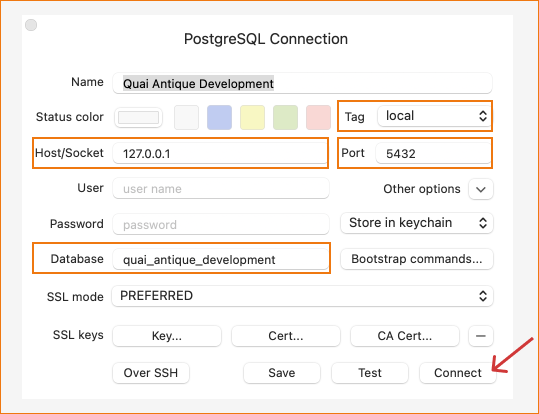

# Quai antique Restaurant
This is a study project concerning the creation of a full stack web application for a French Savoyard restaurant. Visitors and clients can make a reservation and modify it. Registered customers have additional advantages when making a reservation with their pre-stored data and access to their booking history.

# Technologies and tools

- Rails (Ruby on Rails) full stack framework
- Tailwind css framework
- Rubymine IDE
- Use of [Turbo frames](https://turbo.hotwired.dev/handbook/introduction), from [Hotwire](https://hotwired.dev), that makes "hide" AJAX.
- Database created with PostgreSQL


# Set up a local development environment

## Clone the project

https://github.com/KamiGdev/quai_antique.git

## Rails, Ruby and PostgreSQL installations

[Follow these instructions on GoRails](https://gorails.com/setup/windows/10)

## Before running
```bash
rails -v 
# should be Rails 7.0.4.2

ruby -v
# ruby 3.2.1

psql --version
# For info psql (PostgreSQL) 14.7 (Homebrew)
```

### Run migrations and seeds
In your terminal:
```bash
git clone https://github.com/KamiGdev/quai_antique.git
cd quai_antique
./bin/bundle install # to install dependencies
./bin/rails db:migrate db:seed
```

### Creating Database

Rubymine IDE embeds an integrated database view. However, if you have not RubyMine you can install for instance TablePlus, a modern, native and friendly GUI tool for SQL relational databases.

- Install [TablePlus](https://tableplus.com) e.g.
- Fill in the database connection :
- The name of the project is on your own, in gray color on the following caption.
- The database name must be : quai_antique_development
- Enter the host/socket, tag and port related to PostgreSQL mentionned below.
- Then click on "Connect".




## Running command
In your terminal:
```bash 
./bin/dev 
```
And then go to: http://localhost:3000 to launch the web app.
Now, you're normally in!


## To login as an admin, just in local
Go to this sign in page:
http://localhost:3000/users/sign_in

Note that images coming from the backoffice (menu images) will be not visible on your local environment as i uploaded them directly from my computer to backoffice.  
These kind of images come not from seeds.rb file.

<u>Authentication :</u>   
email: kami@k.k   
password: rv3gJ5g^67M*N[    

You can change your email & password on rails seeds.rb file (db folder).


